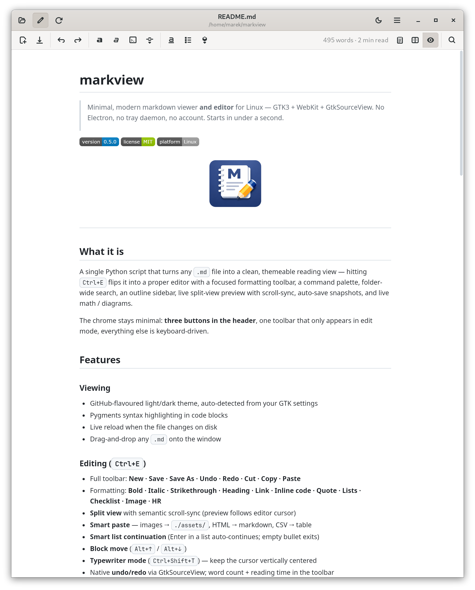
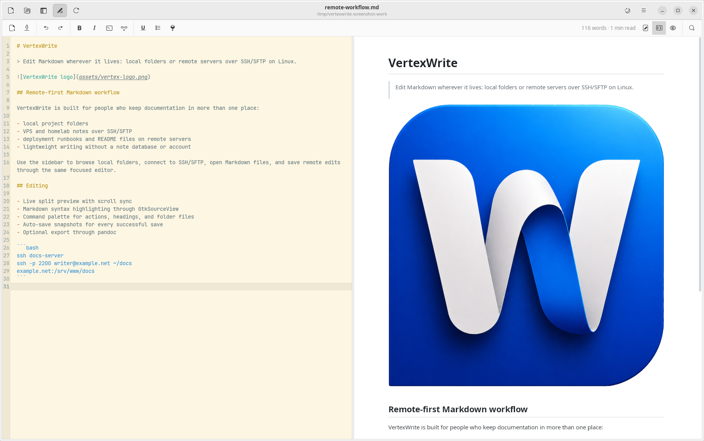
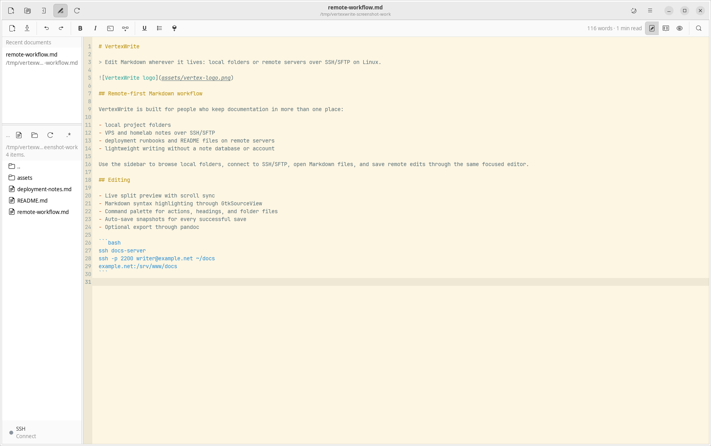
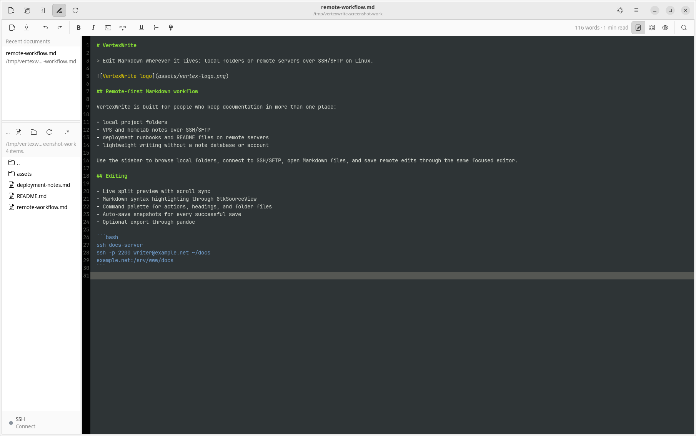
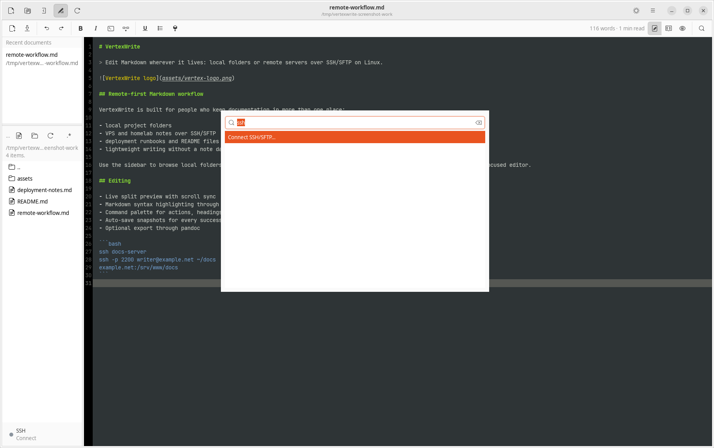

# VertexWrite

> Minimal, modern markdown viewer **and editor** for Linux and Windows.
> GTK3 + WebKit on Linux. PyQt6 + QtWebEngine on Windows.
> No Electron, no tray daemon, no account. Starts in under a second.

[](CHANGELOG.md)
[](LICENSE)
[](#install)
[](https://snapcraft.io/vertexwrite)
[](https://launchpad.net/~mareekkk/+archive/ubuntu/canarybuilds)
[](https://flathub.org/apps/com.canarybuilds.VertexWrite)

<p align="center">
  
</p>

## Screenshots

<p align="center">
  <a href="docs/screenshots/01-preview.png"></a>
  <a href="docs/screenshots/02-split-view.png"></a>
</p>
<p align="center">
  <a href="docs/screenshots/03-editor.png"></a>
  <a href="docs/screenshots/04-dark-mode.png"></a>
  <a href="docs/screenshots/05-command-palette.png"></a>
</p>

<p align="center"><sub>Reading view · Split view · Editor · Dark theme · Command palette (Ctrl+P)</sub></p>

---

## What it is

A single Python script that turns any `.md` file into a clean, themeable reading view — hitting `Ctrl+E` flips it into a proper editor with a focused formatting toolbar, a command palette, folder-wide search, a document sidebar with recents and a folder tree, live split-view preview with scroll-sync, auto-save snapshots, and live math / diagrams.

The chrome stays minimal: compact header buttons, one toolbar that only appears in edit mode, and keyboard access for everything else.

## Features

### Viewing
- GitHub-flavoured light/dark theme, auto-detected from your system theme
- Pygments syntax highlighting in code blocks
- Live reload when the file changes on disk
- Drag-and-drop any `.md` onto the window

### Editing (`Ctrl+E`)
- Full toolbar: **New · Save · Save As · Undo · Redo · Cut · Copy · Paste**
- Formatting: **Bold · Italic · Strikethrough · Heading · Link · Inline code · Quote · Lists · Checklist · Image · HR**
- **Split view** with semantic scroll-sync (preview follows editor cursor)
- **Smart paste** — images → `./assets/`, HTML → markdown, CSV → table
- **Smart list continuation** (Enter in a list auto-continues; empty bullet exits)
- **Block move** (`Alt+↑` / `Alt+↓`)
- **Typewriter mode** (`Ctrl+Shift+T`) — keep the cursor vertically centered
- Native **undo/redo** via GtkSourceView; word count + reading time in the toolbar

### Preview extras
- **KaTeX** math (`$x^2$`, `$$\int$$`, `\(…\)`, `\[…\]`)
- **Mermaid** diagrams in ` ```mermaid ` fences
- **Transclusion** — `![[other-note]]` or `![[other-note#Section]]`
- **Click-to-toggle task checkboxes** in preview — round-trips to source
- **Print stylesheet** and a **custom CSS drop-in** (`~/.config/vertexwrite/custom.css`)
- Tables, footnotes, admonitions, definition lists, abbreviations

### Navigation
- **Command palette** (`Ctrl+P`) — fuzzy jump to actions, headings, or files in the folder
- **Folder full-text search** (`Ctrl+Shift+F`) — recursive `.md`, context snippets
- **Document sidebar** (`Ctrl+Shift+O`) — resizable left pane with recent documents on top and the current folder tree below; choose either a folder or a file to set the tree root
- **Back / forward** (`Alt+←` / `Alt+→`) — history of opened files + cursor lines

### Palette actions (Ctrl+P)
Open / New / Save · Toggle edit / split / preview · Sidebar · Typewriter · Reload · Theme · Folder search · **Open from URL** · **Insert table** · **All tasks in folder** · **Backlinks to this file** · **Check links** · **Snapshot history** · **Export PDF / DOCX / HTML / EPUB** via pandoc.

### Persistence
- Every save writes a dated copy to `~/.local/state/vertexwrite/snapshots/`. Latest 30 per document; browse with the palette.

## Install

<p align="center">
  <a href="https://snapcraft.io/vertexwrite"></a>
  <a href="https://launchpad.net/~mareekkk/+archive/ubuntu/canarybuilds"></a>
  <a href="https://flathub.org/apps/com.canarybuilds.VertexWrite"></a>
</p>

### Windows

Download the latest Windows installer from [GitHub Releases](https://github.com/Canary-Builds/vertexwrite/releases).
Tagged releases also publish `.zip` and `.tar.gz` source archives there for manual installs and downstream packaging.

The Windows build ships as an `.exe` installer built with Inno Setup and includes the packaged PyQt6 runtime.

### Ubuntu (App Center via PPA)

```bash
sudo add-apt-repository ppa:mareekkk/canarybuilds
sudo apt update
sudo apt install vertexwrite
```

### Snapcraft

```bash
sudo snap install vertexwrite
```

### Flathub

```bash
flatpak install flathub com.canarybuilds.VertexWrite
flatpak run com.canarybuilds.VertexWrite
```

### Linux source install (Ubuntu 22.04+ / Debian 12+)

```bash
sudo apt install python3-gi gir1.2-gtk-3.0 gir1.2-webkit2-4.1 \
                 gir1.2-gtksource-4 python3-markdown python3-pygments

git clone https://github.com/Canary-Builds/vertexwrite.git ~/vertexwrite
cd ~/vertexwrite && ./install.sh
```

### Arch

```bash
sudo pacman -S python-gobject gtk3 webkit2gtk-4.1 gtksourceview4 \
               python-markdown python-pygments
```

### Fedora

```bash
sudo dnf install python3-gobject gtk3 webkit2gtk4.1 gtksourceview4 \
                 python3-markdown python3-pygments
```

### Optional

| Dep | Adds |
|---|---|
| `pandoc` | PDF / DOCX / HTML / EPUB export from the palette |
| `python3-html2text` | Higher-quality HTML-clipboard → markdown conversion |
| internet | KaTeX + Mermaid (loaded from a CDN on each render) |

### Windows build from source

```powershell
py -3.13 -m pip install -r requirements-win.txt pyinstaller
powershell -ExecutionPolicy Bypass -File .\build_win.ps1
```

This produces:

| Path | Purpose |
|---|---|
| `dist\vertexwrite\vertexwrite.exe` | packaged Windows app |
| `installer_output\vertexwrite-<version>-win-setup.exe` | Windows installer |

## Run

Linux:

```bash
vertexwrite           # welcome screen
vertexwrite notes.md  # open a file
vertexwrite -V  # version
```

Windows:

```powershell
.\dist\vertexwrite\vertexwrite.exe
py .\vertexwrite_win.py README.md
```

## Shortcuts

| Key | Action |
|---|---|
| `Ctrl+O` | Open file |
| `Ctrl+N` | New document |
| `Ctrl+S` / `Ctrl+Shift+S` | Save / Save As |
| `Ctrl+E` | Toggle edit mode |
| `Ctrl+P` | Command palette |
| `Ctrl+F` / `Ctrl+Shift+F` | Find in buffer / Search in folder |
| `Ctrl+Shift+O` | Toggle document sidebar |
| `Ctrl+Shift+T` | Toggle typewriter mode |
| `Ctrl+R` | Reload from disk |
| `Ctrl+D` | Toggle theme |
| `Ctrl+Q` | Quit |
| `Alt+←` / `Alt+→` | Back / forward |
| `Alt+↑` / `Alt+↓` | Move line/selection |
| `Ctrl+B / I / K / H` | Bold / Italic / Link / Heading |
| `Ctrl+Z` / `Ctrl+Shift+Z` | Undo / Redo |

Full reference: [`docs/wiki/Keyboard-Shortcuts.md`](docs/wiki/Keyboard-Shortcuts.md).

## Configuration

VertexWrite is configuration-free by default. Optional drop-ins:

| Path | Purpose |
|---|---|
| `~/.config/vertexwrite/custom.css` | Appended to the preview stylesheet on every render |
| `<doc>/assets/` | Where pasted images land (auto-created) |
| `~/.local/state/vertexwrite/snapshots/` | Auto-save history |

See [Configuration](docs/wiki/Configuration.md) for details.

## Layout

```
VertexWrite/
├── vertexwrite.py         # Linux GTK3/WebKit frontend
├── vertexwrite_win.py     # Windows PyQt6/QtWebEngine frontend
├── vertexwrite_core.py    # shared markdown/rendering helpers
├── style.css           # preview theme (light/dark/print)
├── vertexwrite-logo.png # final logo source
├── icon-final.png      # copy of the final logo source
├── icon.png            # 512×512 square generated from the logo
├── icon-{16..256}.png  # hicolor sizes generated from the logo
├── vertexwrite.desktop    # desktop entry template
├── install.sh          # user-local installer
├── build_win.ps1       # Windows bundle + installer helper
├── installer_win.iss   # Inno Setup script
├── requirements-win.txt
├── vertexwrite.spec       # PyInstaller spec for Windows
├── uninstall.sh
├── CHANGELOG.md
├── ROADMAP.md
├── CONTRIBUTING.md
├── LICENSE
├── .github/            # issue + PR templates, CI
└── docs/wiki/          # wiki pages (mirrored to the GitHub wiki)
```

## Architecture (TL;DR)

Render pipeline: `markdown` + shared preprocessors (tasks, transclusion) → HTML → native webview frontend. Linux uses GTK3 + WebKit2. Windows uses PyQt6 + QtWebEngine/QWebChannel. See [Architecture](docs/wiki/Architecture.md).

## Roadmap

Planned features and the ones intentionally skipped live in [ROADMAP.md](ROADMAP.md).

## Contributing

Pull requests welcome — please read [CONTRIBUTING.md](CONTRIBUTING.md) first. Small, focused PRs against `main`.

## License

MIT — see [LICENSE](LICENSE).

## Acknowledgments

- [python-markdown](https://python-markdown.github.io/) + [Pygments](https://pygments.org/) for rendering
- [GtkSourceView](https://wiki.gnome.org/Projects/GtkSourceView) for the editor
- [KaTeX](https://katex.org/) and [Mermaid](https://mermaid.js.org/) for math and diagrams
